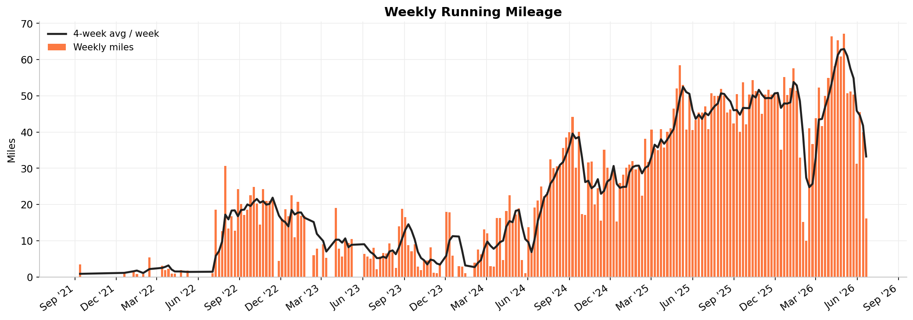
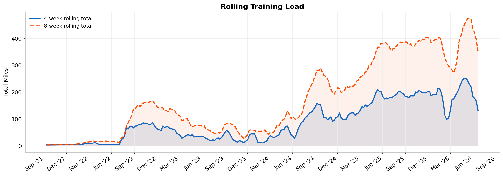
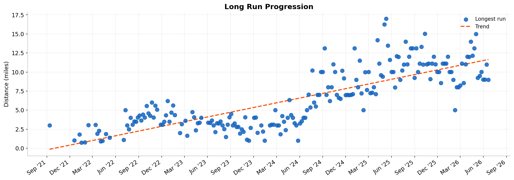
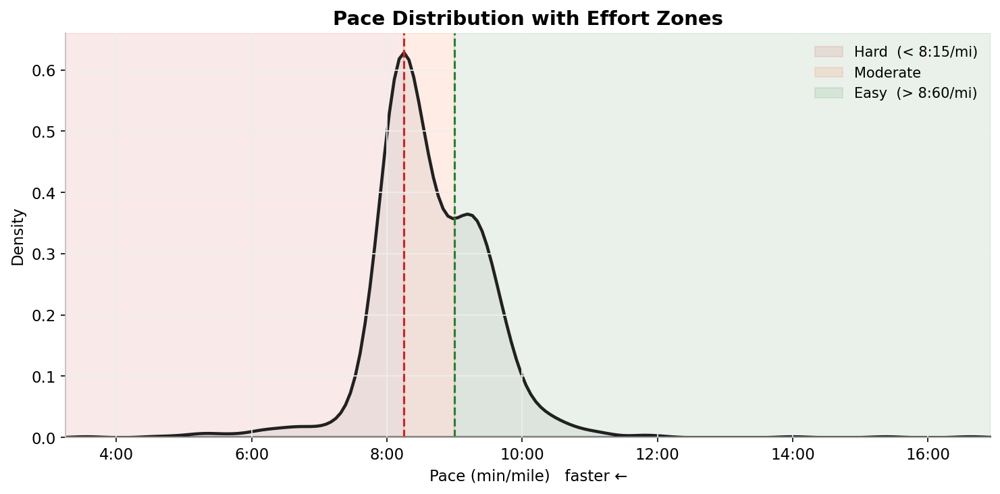
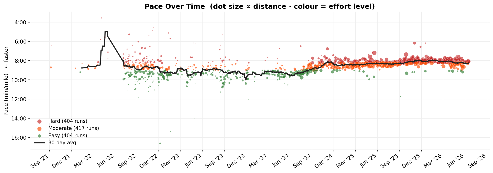
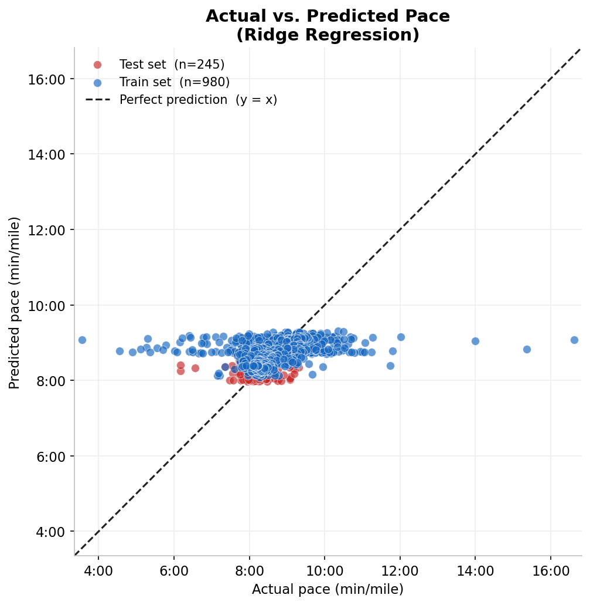

# Running Performance Analytics

> An end-to-end data science pipeline that transforms personal Strava running data into training-load metrics, effort classification, and exploratory pace modeling.

[](https://python.org)
[](https://pandas.pydata.org)
[](https://scikit-learn.org)
[](LICENSE)

---

## Overview

This project processes a raw Strava bulk-export CSV through a four-stage pipeline: data cleaning, feature engineering, pace prediction modeling, and automated figure generation. The analysis explores how weekly mileage, training load, and recent running history associate with run pace — without overclaiming causal relationships.

**Questions explored:**
- How has weekly mileage and long-run distance trended over time?
- How does pace vary across training periods and effort levels?
- Can recent training-load features explain variance in per-run pace?

> **Privacy** — Raw GPS data and personal activity records are excluded from this repository via `.gitignore`. Only source code and generated figures are committed.

---

## Figures

*Run `python pipeline.py` to generate these from your own data.*

### Weekly Mileage


### Rolling Training Load


### Long Run Progression


### Pace Distribution with Effort Zones


### Pace Over Time by Effort Level


### Actual vs. Predicted Pace (Ridge Regression)


---

## Tech Stack

| Library | Role |
|---|---|
| **pandas** | Data loading, cleaning, weekly resampling |
| **NumPy** | Rolling feature computation, trend fitting |
| **scikit-learn** | Ridge regression, StandardScaler, evaluation metrics |
| **Matplotlib** | All figures |
| **seaborn** | Kernel density estimate for pace distribution |

---

## Project Structure

```
.
├── src/
│   ├── clean_strava.py      # Step 1 — load, filter, unit conversion, outlier removal
│   ├── features.py          # Step 2 — rolling load features, effort classification
│   ├── model.py             # Step 3 — Ridge regression, chronological train/test split
│   └── visualize.py         # Step 4 — generate all figures
├── figures/                 # Generated PNG charts (committed to git)
├── docs/
│   └── project_summary.md   # Methods, assumptions, and limitations
├── data/
│   ├── raw/                 # Raw Strava export — git-ignored
│   └── clean/               # Processed CSVs — git-ignored
├── pipeline.py              # Orchestrates all four steps end-to-end
├── requirements.txt
└── .gitignore
```

---

## Getting Started

### 1. Export your Strava data

1. Go to [strava.com](https://www.strava.com) → **Settings → My Account**
2. Scroll to **Download or Delete Your Account → Request Your Archive**
3. Strava emails a `.zip` — unzip it and find `activities.csv`
4. Copy it to `data/raw/activities.csv`

### 2. Install dependencies

```bash
python3 -m venv .venv
source .venv/bin/activate        # macOS / Linux
# .venv\Scripts\activate         # Windows

pip install -r requirements.txt
```

### 3. Run the pipeline

```bash
python pipeline.py
```

Figures are saved to `figures/`. Run individual steps if needed:

```bash
python src/clean_strava.py   # clean raw data
python src/features.py       # build training-load features
python src/model.py          # train pace model  (requires ≥ 20 runs)
python src/visualize.py      # generate all figures
```

---

## Methodology

A full write-up is in [docs/project_summary.md](docs/project_summary.md).

**Cleaning** — Filters to `Activity Type == "Run"`, converts Strava's km distances to miles and seconds to minutes, removes rows outside physically plausible pace bounds (3–30 min/mile).

**Feature engineering** — Builds rolling training-load windows (7, 28, 56 days) from a daily mileage series. A `shift(1)` is applied so each window covers only days prior to the run date — no data leakage. Each run is classified Easy / Moderate / Hard by its pace tertile within the full dataset.

**Modeling** — Ridge regression predicts pace from six features: log-distance, rolling mileage windows, days since last run, sequential run index, and calendar month. The train/test split is **time-ordered** (first 80% of runs for training, last 20% for testing) to mirror real deployment — the model never sees future data during training.

**Model finding** — On the held-out test set the Ridge model achieves negative R², meaning it does not outperform a naive mean predictor. This is itself informative: it indicates a pace distribution shift between the training and test periods, illustrating a known limitation of fitting a single linear trend to a non-stationary physiological time series. See [docs/project_summary.md](docs/project_summary.md) for a full discussion.

---

## License

MIT

---

*Raw activity data excluded for privacy. Built with Python.*
